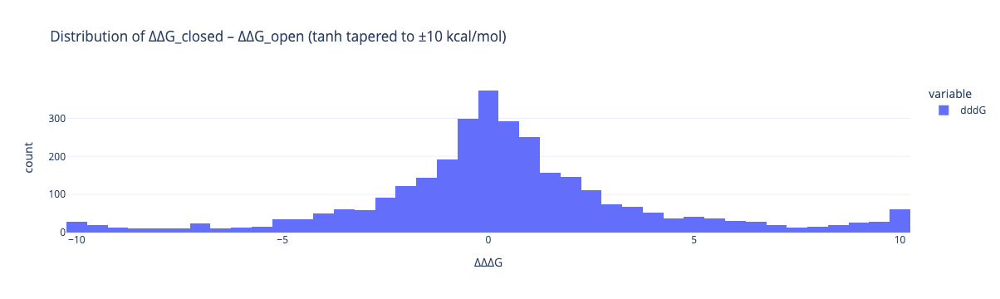

# Dengue-NS2B-NS3-closed-state-design
Wild type Dengue NS2B-NS3 protease refuses to crystallise in the closed/reaction-ready state: 
AI designs to the rescue!

Zika NS2B+NS3, PDB:8PN6, is in the closed state.

The fusion of Dengue NS2B-GGGGSGGGG-NS3 results in domain swapping.

Andre Schützer visually looked at the model and made a trimmed construct,
this construct was the basis for the design,
but the AA numbering was (mostly) kept to the original.
(I don't know the construct name, so in the files it is called `andre`)

## AlphaFold3 Modelling of constructs

I had envisioned that the AF3 models would refuse to fold in the closed state.
They actually _mostly_ fold in the closed state.

RMSD of replicates vs. state that matches PDB:8PN6

| experiment   |   count |     mean |       std |      min |      25% |      50% |      75% |      max |
|:-------------|--------:|---------:|----------:|---------:|---------:|---------:|---------:|---------:|
| fusion       |       5 | 0.964802 | 0.0316412 | 0.929486 | 0.944555 | 0.965687 | 0.971505 |  1.01278 |
| split_andre  |      25 | 3.30666  | 3.92184   | 0        | 0.752309 | 0.914142 | 8.00751  | 13.0989  |
| split_full   |      25 | 4.0446   | 3.29357   | 1.89563  | 2.19573  | 2.37641  | 2.75445  | 12.6187  |

Full table: [af3_rmsds file](af3_rmsds.csv)

The construct matches very well the Zika model, PDB:8PN6, 
therefore, there is no need to thread the sequence on PDB:8PN6 then!

The [top model of the andre split](models/split_andre_model.cif) is correct 
and the replicates were modelled over half the time in the correct state.
The [top model of split NSP2B-NSP3 full sequence](models/split_full_model.cif) is in wrong state,
and the _mostly_ correct state is visited once or twice only ([example](split_full-seed-666_sample-3.cif)).

Mostly: top constructs in mostly correct state (fusion, trimmed, full):

## Point mutations

What point mutations are neutral or stabilising for the closed state, but are destabilising for the open state?
And which of these have precedence in homologues?

Two strategies:

* Point mutation on both open and closed states, with check against MSA conservation
* NSP2B has a linker in the middle: FastDesign of loop beteen W and P

All residue numbering are in the trimmed construct numbering (off by +22 in NSP3).
All residues that are beyond a 6Å distance from S36 D60 H120 can be mutated.

### Point mutation scanning

A caveat is that the closed model scores 652.4 kcal/mol, 
while the open (derived from a different AF3 model) gets -589.0 kcal/mol,
making it easier _a priori_ to find stabilising mutations for the open state.
Nevertheless, there were several candidates that were stabilising for the closed state.
Two caveats:

* the mutations had to be >6Å contact-distance from the catalytic triad.
    M37F was a mutation of interest to Mike as it is in Zika (S36D M37F),
    but is too close to the catalytic triad.
* there is a transient interaction between the N-terminus NSP2B in helical/open form,
the loss of which may be spuriously destabilising.

(gold: catalytic triad, turquoise: 6Å neighbourhood, tints of red: stabilising for closed state)

The MSA generated for AF3 modelling was used (NSP2B: 2525, NSP3: 11768).
The tally was weighted by the Hamming similarity of homologue vs. Dengue and by the sum of the sequences weights,
formally:

$$S_i = \frac{1}{n} \sum_{j=1}^{n} \mathbb{1}(M_{i,j} \eq M_{1,j})$$

$$F_k = \frac{\sum_{i} S_i \cdot \mathbb{1}(M_{i, j} = k)}{\sum_{i} S_i}$$

where:

- $S_i$ is the Hamming similarity between row $i$ and the first row (Dengue),
- $n$ is the number of sequences,
- $F_k$ is the frequency of an amino acid or gap $k$, computed using the weighted tally.

| mutation_full   |   ∆∆∆G | closed_∆∆G |   open_complex_∆∆G |   log10_MSA_freq |
|:----------------|-------:|-------------:|-------------------:|-----------------:|
| G22P:A          | -157.5 |          0.3 |              157.9 |           N/A   |
| G22H:A          |  -11.9 |          0.7 |               12.6 |           N/A   |
| G22T:A          |  -10.2 |          0.4 |               10.6 |           N/A   |
| G22S:A          |   -5.1 |         -0.6 |                4.5 |           N/A   |
| P25L:A          |   -4.7 |          0.2 |                4.8 |           N/A   |
| S21G:A          |   -4.6 |          0.6 |                5.1 |           N/A   |
| S32W:A          |   -4.4 |          0.2 |                4.6 |           N/A   |
| I20Q:A          |   -4.2 |         -0.1 |                4.1 |             -2.4 |
| S32Y:A          |   -4.1 |         -4.1 |                0   |           N/A   |
| P25H:A          |   -3.9 |          0.6 |                4.5 |             -2.4 |
| S38F:A          |   -3.9 |         -0.4 |                3.4 |           N/A   |
| Q17R:A          |   -3.9 |         -1.2 |                2.6 |           N/A   |
| E5W:A           |   -3.6 |         -0.7 |                2.9 |           N/A   |
| V12L:A          |   -3.5 |          0.3 |                3.8 |             -3.4 |
| G22N:A          |   -3.3 |          0.8 |                4.1 |           N/A   |
| S32H:A          |   -3.3 |         -1.1 |                2.2 |           N/A   |
| S32N:A          |   -2.9 |         -2.2 |                0.7 |           N/A   |
| S28W:A          |   -2.8 |            0 |                2.9 |           N/A   |
| S32F:A          |   -2.8 |         -2.1 |                0.8 |             -3.2 |
| S38Y:A          |   -2.8 |         -0.3 |                2.5 |           N/A   |
| S28T:A          |   -2.6 |         -0.5 |                2.1 |             -2.9 |
| V12I:A          |   -2.5 |          0.5 |                3   |             -1.2 |
| K40Y:A          |   -2.5 |          0.5 |                3   |           N/A   |
| T30L:A          |   -2.4 |         -1.3 |                1.2 |           N/A   |
| S21T:A          |   -2.4 |         -1.9 |                0.5 |             -1   |
| E5F:A           |   -2.4 |         -1.2 |                1.2 |           N/A   |
| S23P:A          |   -2.4 |         -2.3 |                0.1 |           N/A   |
| S32A:A          |   -2.2 |         -0.3 |                1.9 |             -1.9 |
| S28V:A          |   -2.2 |         -1.1 |                1.1 |           N/A   |
| S38H:A          |   -2.1 |         -0.3 |                1.8 |           N/A   |
| S28F:A          |     -2 |         -0.2 |                1.8 |           N/A   |
| T30I:A          |     -2 |         -1.8 |                0.2 |             -2.4 |
| T118F:B         |  -27.1 |          0.7 |               27.8 |           N/A   |
| E169P:B         |  -19.5 |         -0.7 |               18.8 |             -3.9 |
| A56L:B          |  -17.2 |          0.6 |               17.8 |             -4.2 |
| A56E:B          |  -14.5 |          0.4 |               14.9 |             -2.4 |
| G121T:B         |    -14 |            1 |               15   |             -3.3 |
| K170P:B         |    -13 |         -1.1 |               11.9 |           N/A   |
| A56I:B          |  -11.3 |          0.9 |               12.2 |           N/A   |
| A56Q:B          |  -10.7 |         -0.2 |               10.5 |           N/A   |
| E91W:B          |  -10.2 |          0.1 |               10.3 |           N/A   |
| A56R:B          |   -9.5 |         -1.1 |                8.4 |             -3.5 |
| V155Y:B         |   -9.2 |         -0.6 |                8.6 |             -2.3 |
| V155Q:B         |   -8.9 |         -0.1 |                8.9 |             -4.1 |
| V155F:B         |   -8.6 |         -0.2 |                8.4 |             -2.8 |
| E91Y:B          |   -8.4 |          0.7 |                9.1 |           N/A   |
| I123Y:B         |   -8.3 |         -0.3 |                8.1 |             -3.2 |
| A56M:B          |   -7.8 |          0.6 |                8.4 |             -4.4 |
| A56K:B          |   -7.8 |          0.4 |                8.2 |             -4   |
| I123W:B         |   -7.6 |          0.9 |                8.5 |             -4.2 |
| S127G:B         |   -7.1 |          0.3 |                7.4 |             -2.5 |
| I123F:B         |   -6.8 |            0 |                6.8 |             -3.5 |
| K61E:B          |   -6.3 |         -1.7 |                4.6 |             -1.4 |
| S127A:B         |   -5.9 |         -2.8 |                3.1 |             -0.4 |
| E91L:B          |   -5.8 |            1 |                6.8 |             -3.7 |
| K142Y:B         |   -5.7 |            1 |                6.7 |             -4.1 |
| T156L:B         |   -5.6 |          0.4 |                6   |             -1.4 |
| G80W:B          |   -5.6 |          0.2 |                5.7 |           N/A   |
| S171I:B         |   -5.6 |         -2.3 |                3.3 |           N/A   |
| E91K:B          |   -5.4 |          0.3 |                5.7 |             -0.9 |
| S127L:B         |   -5.4 |         -0.4 |                4.9 |             -3   |
| K26V:B          |   -5.3 |          0.6 |                5.9 |             -2.3 |
| V155R:B         |   -5.2 |            1 |                6.1 |             -3   |
| K26I:B          |   -5.1 |          0.8 |                5.9 |             -2.8 |
| R64I:B          |   -4.9 |          0.6 |                5.4 |             -2.3 |
| S127D:B         |   -4.8 |         -0.9 |                3.9 |             -3.1 |
| T122E:B         |   -4.8 |          0.6 |                5.4 |             -0.2 |
| K61D:B          |   -4.8 |         -1.3 |                3.5 |             -1.7 |
| N119P:B         |   -4.8 |         -0.7 |                4.1 |             -0.4 |
| K61Q:B          |   -4.6 |         -2.5 |                2.1 |             -0.7 |
| A56T:B          |   -4.5 |           -0 |                4.5 |             -3.7 |
| E91P:B          |   -4.1 |         -2.8 |                1.3 |             -3.1 |
| I65Y:B          |   -4.1 |          0.8 |                4.9 |             -4.1 |
| I140L:B         |   -4.1 |         -0.2 |                3.9 |             -0.9 |
| S127Q:B         |   -4.1 |         -1.1 |                2.9 |             -4   |
| A56N:B          |     -4 |            1 |                5   |             -3.3 |
| I172E:B         |   -3.9 |          0.3 |                4.2 |           N/A   |
| S171T:B         |   -3.9 |         -1.6 |                2.3 |             -3.6 |
| K117D:B         |   -3.8 |         -0.7 |                3.1 |             -3.1 |
| K61A:B          |   -3.8 |          0.5 |                4.3 |             -3   |
| I172H:B         |   -3.8 |          0.6 |                4.3 |           N/A   |
| S171V:B         |   -3.7 |         -0.7 |                3   |           N/A   |
| T122I:B         |   -3.6 |         -1.2 |                2.4 |             -2.8 |
| K117N:B         |   -3.5 |           -1 |                2.5 |             -2.4 |
| S68Y:B          |   -3.5 |         -2.1 |                1.4 |             -0.5 |
| K117H:B         |   -3.3 |         -1.8 |                1.5 |           N/A   |
| S68F:B          |   -3.2 |         -1.1 |                2.1 |             -3   |
| E88W:B          |   -3.2 |          0.9 |                4.1 |           N/A   |
| T122V:B         |   -3.2 |         -1.3 |                1.9 |             -2.9 |
| K61S:B          |   -3.1 |          0.8 |                3.9 |             -3.1 |
| K61G:B          |   -3.1 |          0.1 |                3.2 |             -0.5 |
| S127N:B         |   -3.1 |         -1.6 |                1.4 |             -3   |
| G80L:B          |     -3 |         -1.5 |                1.5 |           N/A   |
| S127M:B         |     -3 |         -0.8 |                2.2 |             -4.4 |
| K61N:B          |     -3 |         -1.9 |                1.1 |             -0.9 |
| I65F:B          |     -3 |          0.1 |                3.1 |             -3.3 |
| T122D:B         |     -3 |          0.9 |                3.9 |             -1.3 |
| K61H:B          |   -2.9 |          0.7 |                3.6 |             -3.3 |
| E93Q:B          |   -2.9 |           -1 |                1.9 |             -4   |
| A70S:B          |   -2.8 |          0.1 |                2.9 |             -3.6 |
| K26R:B          |   -2.8 |            0 |                2.8 |             -4.2 |
| G80H:B          |   -2.7 |         -1.8 |                1   |           N/A   |
| Y41V:B          |   -2.7 |            0 |                2.7 |             -2.4 |
| R64L:B          |   -2.7 |          0.7 |                3.4 |             -2.5 |
| S171D:B         |   -2.7 |         -3.3 |               -0.7 |             -3.3 |
| I140V:B         |   -2.6 |         -1.9 |                0.8 |             -0.2 |
| S127R:B         |   -2.6 |          0.2 |                2.9 |           N/A   |
| T118I:B         |   -2.6 |          0.9 |                3.5 |             -2.3 |
| S127C:B         |   -2.5 |         -0.1 |                2.4 |             -3.3 |
| S68A:B          |   -2.5 |         -1.7 |                0.8 |             -3   |
| H60Y:B          |   -2.5 |         -2.8 |               -0.3 |             -0.6 |
| N105H:B         |   -2.5 |         -1.3 |                1.1 |             -4.1 |
| G80R:B          |   -2.4 |           -0 |                2.3 |           N/A   |
| G29Y:B          |   -2.3 |         -4.3 |               -1.9 |             -1.8 |
| H60F:B          |   -2.3 |         -2.7 |               -0.4 |             -3.1 |
| T45S:B          |   -2.3 |          0.6 |                2.9 |             -3.3 |
| E169I:B         |   -2.3 |          0.8 |                3.1 |           N/A   |
| S171F:B         |   -2.3 |         -0.3 |                2   |           N/A   |
| G80E:B          |   -2.2 |         -1.6 |                0.6 |           N/A   |
| E93L:B          |   -2.2 |          0.7 |                3   |           N/A   |
| S68H:B          |   -2.2 |         -0.7 |                1.5 |             -2.1 |
| K28V:B          |   -2.2 |          0.1 |                2.3 |             -3.5 |
| A56S:B          |   -2.2 |          0.1 |                2.2 |             -1.1 |
| K117I:B         |   -2.1 |         -1.7 |                0.5 |             -2.1 |
| Y33P:B          |   -2.1 |         -1.5 |                0.6 |             -3.3 |
| S68E:B          |   -2.1 |            0 |                2.1 |             -3   |
| A120T:B         |   -2.1 |         -2.9 |               -0.8 |             -0.4 |
| E94D:B          |     -2 |          0.9 |                3   |             -1.1 |
| Q27R:B          |     -2 |          0.4 |                2.4 |             -2.7 |

## Design of better linker

The linker construct (NS2B-GGGGSGGGG-NS3) is subpar because the protein itself has floppy ends.

However, the linker could be designed to better adhere to the protein.

The design was done in the following stages:

* ~4,000 RFdiffusion designs (5 major series, 3 successful, see below)
* Filtering of RFdiffusion designs: minimum residue pLDDT > 0.90
* No structural filtering were done at this stage
* proteinMPNN designs (507 &times; 5)
* Filtering of proteinMPNN designs: sorted by `global_score` (low is better), cutoff global_score of first polyG sequence
* 1301 AlphaFold3 models (one seed only)
* Filtering of AF3 replicate models: RMSD vs reference closed structure < 1.5Å
* 182 Rosetta FastRelax minimised (5 cycles, ref2015)

Note: pLDDT filtering at the RFdiffusion is a personal choice
as there is a weak correlation (personal results: ask if interested) between
RFdiffusion pLDDT and final Rosetta score.
Likewise, proteinMPNN global_score, but better to stack the deck in your favour.

### Symmetry series

> Experiment group: `mirror`

One design idea was to design a linker that aids dimerisation in the crystal form
seen in PDB:8PN6. See [symmetry.md](symmetry.md) for more details.

This is a rabbit hole of madness —TL;DR: C2 symmetry, but no designed loops aimed dimerisation.
Nevertheless, the symmetry provided a useful no-go zone cutoff.

* Contig: `[A1-40/15-40/A41-196/0 A1001-1040/15-40/A1041-1196/0]`
* N designs: 50 per length = 1,800 
* 
(Note: symmetry does not work with ranges, so an iterations were done)

### Alt cut series

A fusion of NS2B and NS3 needs a long linker,
furthermore, NS2B is not ordered in isolation, 
so it seems unproductive expressing the unstable part first...

The NS2B peptide is formed of

* a N-terminal beta-strand that packs with the C-terminal sheet of NS3
* a long linker
* a C-terminal beta-hairpin

Were the linker ignored as it lacks buried hydrophobic (bar for W14),
the N-terminal beta-strand of NS2B could be appended to the C-terminus of NS3
and the C-terminal beta-hairpin of NS2B could be prepended to the N-terminus of NS3.

The former sheet has two strand adjacent residues of note, NSP2B V12 and NSP3 L18 (3 in Andre).
Cutting after NSP2B V12 and before NSP3 L18, gives 18Å gap (/3.5 = 5AA)
Cutting after NSP2B W14 and before NSP3 L18, gives 21Å gap  (/3.5 = 6AA)

The hairpin is more problematic, 
adding after NSP13 K170 the NSP2B 26-41 beta-hairpin, gives a 28Å gap (8AA).

On initial inspection, it is clear a further design refinement is possible:
inserting the C-terminus hairpin of NSP2B between residue 71–79 (:warning: get Unicode numbering).

* Altcut-A Contig: `[A1-12/6-10/B4-155/8-15/A25-41/0]`
* * Altcut-A N designs: 1,000
* Altcut-B Contig: `A1-12/6-10/B4-76/3-6/A25-41/6-10/B79-155/0`
* * Altcut-B N designs: 500

### ProteinMPNN

Difference in global_score of the two groups:

The rando outliers are the polyG sequences, which is expected/good:

### AF3 scoring

On a A100 the rate limiting step for AF3 is the A3M MSA generation
(~15minutes even with databases on the node's local NVMe).

Without template things fail:

|       |   chain_pair_iptm |   chain_pair_pae_min |   chain_ptm |   fraction_disordered |   has_clash |    ptm |   ranking_score |
|:------|------------------:|---------------------:|------------:|----------------------:|------------:|-------:|----------------:|
| count |            582    |               582    |      582    |                582    |         582 | 582    |          582    |
| mean  |              0.18 |                 0.76 |        0.18 |                  0.62 |           0 |   0.18 |            0.49 |
| std   |              0.03 |                 0    |        0.03 |                  0.18 |           0 |   0.03 |            0.07 |
| min   |              0.14 |                 0.76 |        0.14 |                  0    |           0 |   0.14 |            0.24 |
| 25%   |              0.16 |                 0.76 |        0.16 |                  0.51 |           0 |   0.16 |            0.44 |
| 50%   |              0.17 |                 0.76 |        0.17 |                  0.62 |           0 |   0.17 |            0.49 |
| 75%   |              0.19 |                 0.76 |        0.19 |                  0.73 |           0 |   0.19 |            0.54 |
| max   |              0.35 |                 0.76 |        0.35 |                  1    |           0 |   0.35 |            0.66 |

The WT fails too without MSA:

Oddly, providing a template for the NSP3 also fails.

The solution was then to munge the A3M of the NSP3 to be gapped appropriately.
NSP2B was left out to favour true binders.

### Final selection
Of the 5 replicates in AF3 those with an RMSD under 1.5Å were chosen.

These were minimised with Rosetta FastRelax (5 cycles, ref2015)
with a termini 'stretching' restraint, in the offchance that the termini are badly bundled 
(no case failed, but best be safe).

The number of accepted replicates varied (1.8 mean), but had a standard deviation of 7.8 REU.

164 finalists is not great, but it is only a linker
and the filtering was harsh.

Of the 181 designs, only 73 failed the final filtering due to one or more of the following:
* 53 were singletons
* 15 had more than one residue with a potential worse than 6.0 kcal/mol (harsh)
* 17 had a worse potential than the WT (this is low, but I double-checked for bugs in the code)

The top50 final designs are in [linker-designs](models/linker-designs),
Their sequences are in [top_linker_designs.fasta](linker_designs.fasta) and
the look like:

In the above image, turquoise is the NS3, coral is the design, and gold is the NS2B,
however, the NS2B annotation was a hack in PyMOL and is not accurate,
see JSON files for the actual details.
Also, note that in the PDB files, 
the temperature factor is Rosetta per residue energy, design residues have an occupancy of 0.5,
for proper analysis see the actual json files, this is just for PyMOL.

### Loop design

5 cycles of fast relax with design, with a 1 kcal/mol penalty for a residue change,
against the closed state model of the trimmed construct
and a model with a NSP2B loop between W14 and P25 transplated from PDB:8PN6 (W61 to P72),
namely `WEKDAEVTGNSP` to `WEDQAEISGSSP`, as that is the major difference.

## Chymotrypsin

Other serine proteases, like chymotrypsin are not split. What does that look like?

These extra sheets look different, so poor comparison. I could look for closer structures,
but most likely it will require some effort to find a useful match...

