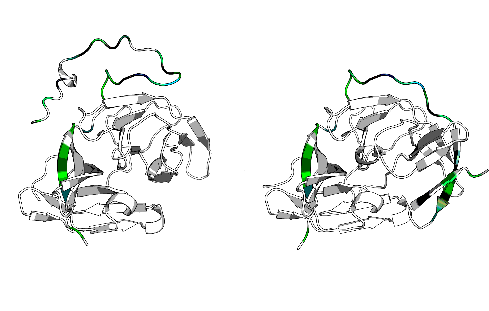

## Pretty picture for report

Forbidden residues:

```pymol
select cata, chain B and resi 51+135+75
select neigh6, (resi 34+35+37 and chain A) or (resi 25+35+36+37+38+39+48+49+50+51+52+53+54+71+72+73+74+75+76+77+83+100+102+130+131+132+133+134+135+136+137+149+150+151+152+161+164+166 and chain B)
select neigh4, (resi 35 and chain A) or (resi 37+38+48+49+50+51+52+53+54+71+72+73+74+75+76+132+133+134+135+136+137+150+151+152+166 and chain B)
color white, element C    
#color gold, chain A and element C
color gold, cata and element C
#color 0xCC5500, neigh4 and element C  # brick
color turquoise, neigh6 and not neigh4 and element C
color atomic, not element C
hide sticks
show sticks, (cata or neigh6) and not element H
```

Mutants:

```pymol
# G22P:A -157.524933567243
color 0xFF0000, resi 22 and chain A
# T118F:B -27.117424745371636
color 0xFF0202, resi 118 and chain B
# E169P:B -19.514215322924656
color 0xFF0A0A, resi 169 and chain B
# A56L:B -17.19261343208825
color 0xFF0F0F, resi 56 and chain B
# G121T:B -14.040268237660598
color 0xFF1D1D, resi 121 and chain B
# K170P:B -12.996452493802963
color 0xFF2323, resi 170 and chain B
# E91W:B -10.199380883298318
color 0xFF3A3A, resi 91 and chain B
# V155Y:B -9.191465702305095
color 0xFF4545, resi 155 and chain B
# I123Y:B -8.336584354926117
color 0xFF5050, resi 123 and chain B
# S127G:B -7.072644322939027
color 0xFF6363, resi 127 and chain B
# K61E:B -6.303677745662526
color 0xFF7070, resi 61 and chain B
# K142Y:B -5.692180458142843
color 0xFF7B7B, resi 142 and chain B
# T156L:B -5.597451476903416
color 0xFF7D7D, resi 156 and chain B
# G80W:B -5.570443637940684
color 0xFF7E7E, resi 80 and chain B
# S171I:B -5.569565041784699
color 0xFF7E7E, resi 171 and chain B
# K26V:B -5.281397526625824
color 0xFF8383, resi 26 and chain B
# R64I:B -4.868005376719225
color 0xFF8B8B, resi 64 and chain B
# T122E:B -4.825748596041876
color 0xFF8C8C, resi 122 and chain B
# N119P:B -4.755619504166702
color 0xFF8E8E, resi 119 and chain B
# P25L:A -4.674029334558213
color 0xFF8F8F, resi 25 and chain A
# S21G:A -4.567888316317294
color 0xFF9191, resi 21 and chain A
# S32W:A -4.405694629094683
color 0xFF9595, resi 32 and chain A
# I20Q:A -4.181398526551675
color 0xFF9A9A, resi 20 and chain A
# I65Y:B -4.115377755459576
color 0xFF9B9B, resi 65 and chain B
# I140L:B -4.094288583977573
color 0xFF9C9C, resi 140 and chain B
# I172E:B -3.9194213008585166
color 0xFF9F9F, resi 172 and chain B
# S38F:A -3.8763268429610207
color 0xFFA0A0, resi 38 and chain A
# Q17R:A -3.854001690254222
color 0xFFA1A1, resi 17 and chain A
# K117D:B -3.805299346888887
color 0xFFA2A2, resi 117 and chain B
# E5W:A -3.557327006877017
color 0xFFA7A7, resi 5 and chain A
# V12L:A -3.5243439179009783
color 0xFFA8A8, resi 12 and chain A
# S68Y:B -3.466057509060761
color 0xFFA9A9, resi 68 and chain B
# E88W:B -3.2012402360243186
color 0xFFB0B0, resi 88 and chain B
# E93Q:B -2.9027580083162547
color 0xFFB6B6, resi 93 and chain B
# A70S:B -2.842586250960494
color 0xFFB8B8, resi 70 and chain B
# S28W:A -2.8374264268973093
color 0xFFB8B8, resi 28 and chain A
# Y41V:B -2.6694129855436586
color 0xFFBCBC, resi 41 and chain B
# K40Y:A -2.477853161059784
color 0xFFC1C1, resi 40 and chain A
# H60Y:B -2.4737057529878257
color 0xFFC1C1, resi 60 and chain B
# N105H:B -2.465273087592095
color 0xFFC1C1, resi 105 and chain B
# T30L:A -2.4209105449928074
color 0xFFC2C2, resi 30 and chain A
# S23P:A -2.3519520955063626
color 0xFFC4C4, resi 23 and chain A
# G29Y:B -2.3485818905840006
color 0xFFC4C4, resi 29 and chain B
# T45S:B -2.3225516582517685
color 0xFFC4C4, resi 45 and chain B
# K28V:B -2.1936798750250546
color 0xFFC7C7, resi 28 and chain B
# Y33P:B -2.1167529338607665
color 0xFFC9C9, resi 33 and chain B
# A120T:B -2.0935276896518644
color 0xFFCACA, resi 120 and chain B
# E94D:B -2.0350204626565755
color 0xFFCBCB, resi 94 and chain B
# Q27R:B -2.0087451822547564
color 0xFFCCCC, resi 27 and chain B
# V57L:B -1.9097734707120253
color 0xFFCECE, resi 57 and chain B
# E19Q:B -1.8454323162782202
color 0xFFD0D0, resi 19 and chain B
# G81S:B -1.8415302711905497
color 0xFFD0D0, resi 81 and chain B
# D16S:A -1.6664915037052879
color 0xFFD4D4, resi 16 and chain A
# T111A:B -1.5406446655948685
color 0xFFD8D8, resi 111 and chain B
# K112V:B -1.49376460551116
color 0xFFD9D9, resi 112 and chain B
# S36T:A -1.3658160116250428
color 0xFFDCDC, resi 36 and chain A
# H47H:B -1.3478164085003073
color 0xFFDCDC, resi 47 and chain B
# K42F:B -1.2629153029020017
color 0xFFDEDE, resi 42 and chain B
# E17D:B -1.2330447546147525
color 0xFFDFDF, resi 17 and chain B
# K90Q:B -1.1856826153994007
color 0xFFE0E0, resi 90 and chain B
# S34K:B -1.181633684270878
color 0xFFE1E1, resi 34 and chain B
# D20P:B -1.1052332415645196
color 0xFFE2E2, resi 20 and chain B
# E43N:B -1.0388907033598116
color 0xFFE4E4, resi 43 and chain B
# E86D:B -1.0151329331878287
color 0xFFE5E5, resi 86 and chain B
# Q167F:B -0.978069328150923
color 0xFFE6E6, resi 167 and chain B
# F46Y:B -0.8968915737832504
color 0xFFE8E8, resi 46 and chain B
# K84Q:B -0.7840976194598852
color 0xFFEBEB, resi 84 and chain B
# G144H:B -0.7770701872182144
color 0xFFEBEB, resi 144 and chain B
# G44G:B -0.6832862374377555
color 0xFFEDED, resi 44 and chain B
# R157R:B -0.6518583766866186
color 0xFFEEEE, resi 157 and chain B
# A10S:A -0.6101819063899256
color 0xFFEFEF, resi 10 and chain A
# E15T:A -0.5943918767064815
color 0xFFEFEF, resi 15 and chain A
# K145M:B -0.5764641792846987
color 0xFFF0F0, resi 145 and chain B
# L6L:A -0.5373325622188077
color 0xFFF1F1, resi 6 and chain A
# A2P:A -0.5125905144381022
color 0xFFF1F1, resi 2 and chain A
# A18A:A -0.4967268704467642
color 0xFFF2F2, resi 18 and chain A
# R8R:A -0.4953170595897518
color 0xFFF2F2, resi 8 and chain A
# K104V:B -0.4720163485745843
color 0xFFF2F2, resi 104 and chain B
# L31W:B -0.4713516932653192
color 0xFFF2F2, resi 31 and chain B
# A160H:B -0.4131595755335411
color 0xFFF4F4, resi 160 and chain B
# G32G:B -0.4058737563932482
color 0xFFF4F4, resi 32 and chain B
# I30H:B -0.36696402929976557
color 0xFFF5F5, resi 30 and chain B
# D129D:B -0.36527480106474286
color 0xFFF5F5, resi 129 and chain B
# L115Q:B -0.24820426990277156
color 0xFFF8F8, resi 115 and chain B
# A22A:B -0.2144788721303712
color 0xFFF9F9, resi 22 and chain B
# L18L:B -0.20987349880704187
color 0xFFF9F9, resi 18 and chain B
# E7E:A -0.200339734151612
color 0xFFF9F9, resi 7 and chain A
# L58L:B -0.1684666656212812
color 0xFFFAFA, resi 58 and chain B
# R24R:B -0.15186617138249403
color 0xFFFBFB, resi 24 and chain B
# K143S:B -0.14868087590195955
color 0xFFFBFB, resi 143 and chain B
# I31I:A -0.13842727356939122
color 0xFFFBFB, resi 31 and chain A
# G21G:B -0.12068328111286064
color 0xFFFBFB, resi 21 and chain B
# L98L:B -0.11764443495906107
color 0xFFFCFC, resi 98 and chain B
# P67P:B -0.1005935918076375
color 0xFFFCFC, resi 67 and chain B
# M59M:B -0.09365121886366978
color 0xFFFCFC, resi 59 and chain B
# I29I:A -0.05977402740973048
color 0xFFFDFD, resi 29 and chain A
# S24S:A -0.04891738553703817
color 0xFFFDFD, resi 24 and chain A
# Y23Y:B -0.03875357961624104
color 0xFFFEFE, resi 23 and chain B
# I26I:A -0.02685135524541238
color 0xFFFEFE, resi 26 and chain A
# K63K:B -0.01525370675983595
color 0xFFFEFE, resi 63 and chain B
# V40V:B -0.01345246714060977
color 0xFFFEFE, resi 40 and chain B
# G62G:B -0.012344536679393059
color 0xFFFEFE, resi 62 and chain B
```

