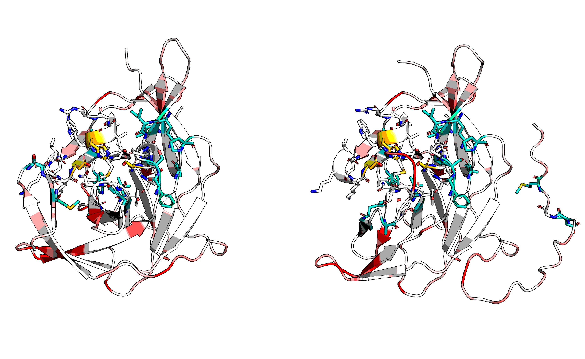

## Pretty picture for report

Forbidden residues:

```pymol
select cata, chain B and resi 36+120+60
select neigh6, (resi 34+35+37 and chain A) or (resi 10+20+21+22+23+24+33+34+35+36+37+38+39+56+57+58+59+60+61+62+68+85+87+115+116+117+118+119+120+121+122+134+135+136+137+146+149+151 and chain B)
select neigh4, (resi 35 and chain A) or (resi 22+23+33+34+35+36+37+38+39+56+57+58+59+60+61+117+118+119+120+121+122+135+136+137+151 and chain B)
color white, element C    
color gold, chain A and element C
color black, cata and element C
color teal, neigh4 and element C
color turquoise, neigh6 and not neigh4 and element C
color atomic, not element C
hide sticks
show sticks, (cata or neigh6) and not element H
```

Mutants:

```pymol
# G22P:A -157.524933567243
color 0xFF1FD1FD, resi 22 and chain A
# P25L:A -4.674029334558213
color 0xFF16E16E, resi 25 and chain A
# S21G:A -4.567888316317294
color 0xFF16C16C, resi 21 and chain A
# S32W:A -4.405694629094683
color 0xFF168168, resi 32 and chain A
# I20Q:A -4.181398526551675
color 0xFF163163, resi 20 and chain A
# S38F:A -3.8763268429610207
color 0xFF15D15D, resi 38 and chain A
# Q17R:A -3.854001690254222
color 0xFF15C15C, resi 17 and chain A
# E5W:A -3.557327006877017
color 0xFF156156, resi 5 and chain A
# V12L:A -3.5243439179009783
color 0xFF155155, resi 12 and chain A
# S28W:A -2.8374264268973093
color 0xFF145145, resi 28 and chain A
# K40Y:A -2.477853161059784
color 0xFF13C13C, resi 40 and chain A
# T30L:A -2.4209105449928074
color 0xFF13B13B, resi 30 and chain A
# S23P:A -2.3519520955063626
color 0xFF139139, resi 23 and chain A
# D16S:A -1.6664915037052879
color 0xFF129129, resi 16 and chain A
# S36T:A -1.3658160116250428
color 0xFF121121, resi 36 and chain A
# A10S:A -0.6101819063899256
color 0xFF10E10E, resi 10 and chain A
# E15T:A -0.5943918767064815
color 0xFF10E10E, resi 15 and chain A
# L6L:A -0.5373325622188077
color 0xFF10C10C, resi 6 and chain A
# A2P:A -0.5125905144381022
color 0xFF10C10C, resi 2 and chain A
# A18A:A -0.4967268704467642
color 0xFF10B10B, resi 18 and chain A
# R8R:A -0.4953170595897518
color 0xFF10B10B, resi 8 and chain A
# E7E:A -0.200339734151612
color 0xFF104104, resi 7 and chain A
# I31I:A -0.13842727356939122
color 0xFF102102, resi 31 and chain A
# I29I:A -0.05977402740973048
color 0xFF100100, resi 29 and chain A
# S24S:A -0.04891738553703817
color 0xFF100100, resi 24 and chain A
# E19E:A -0.045144417608867116
color 0xFF100100, resi 19 and chain A
# I26I:A -0.02685135524541238
color 0xFFFFFF, resi 26 and chain A
```

