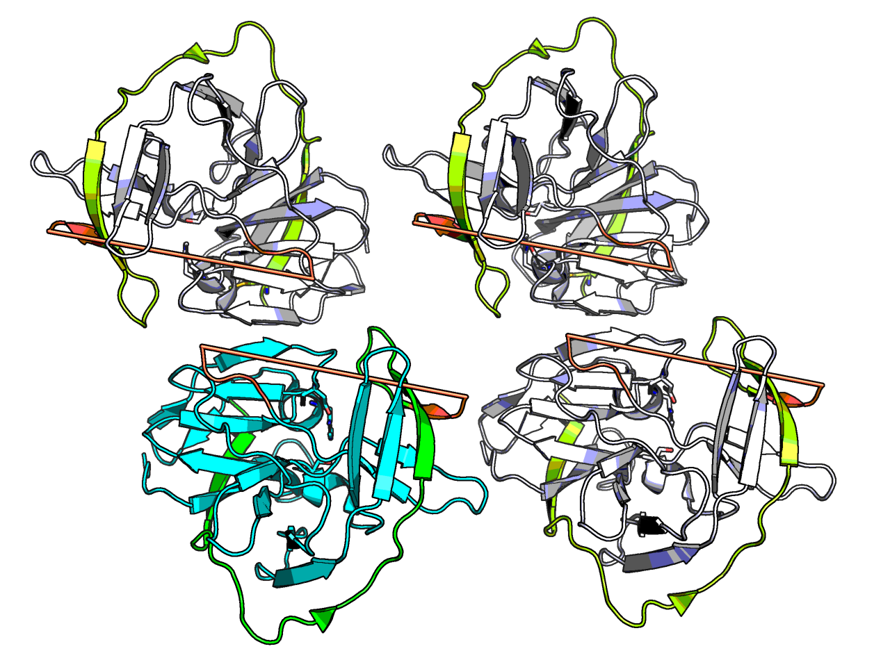
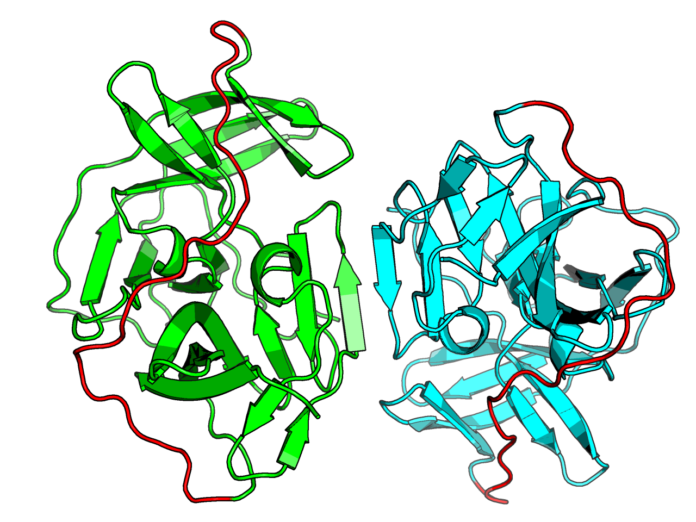
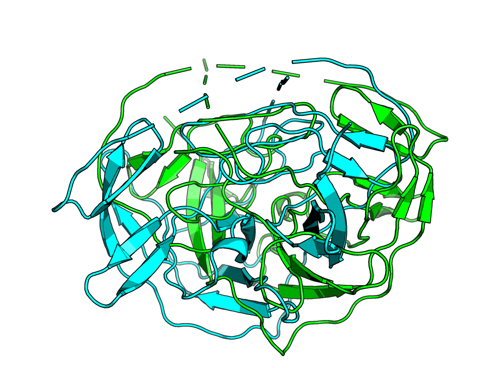
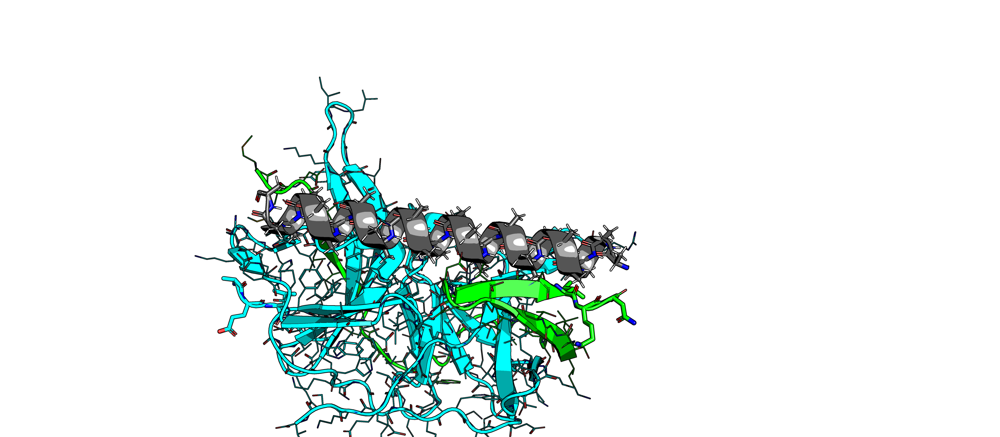

# Symmetry

**Premise** — What if the linker aided dimerisation?
**Second premise**  — The linker should not interfere with crystal packing.

The PDB:8PN6 has $P4_{3}22$ space group.
The closest crystal packing interface is effectively a dimer
by cyclic rotation, because of the skew axis of the tetragonal Bravais lattice.

The rotational axis / Z-axis fortuitously match (mostly),
so there is no need to manually centre it
(for reference, to get this, the trick is that
the midpoint of the pairs of opposite atoms line up on rotational axis)

_None_ of the structures results in a helical bundle of inserts
that dimerise.

The closest insert to the interface is:

Nevertheless, the symmetry provided a useful no-go zone cutoff.

#### Symmetry and hotspots

I have not managed to enable `ppi.hotspot_res` in symmetry mode.
Making the loop a separate construct just causes issues and nothing worked.
Ignore all `independent`, `indymirror`, `hot`, `hotmirror` constructs...

A helical insert would look like this:

which actually would interact marginally with the other chain.